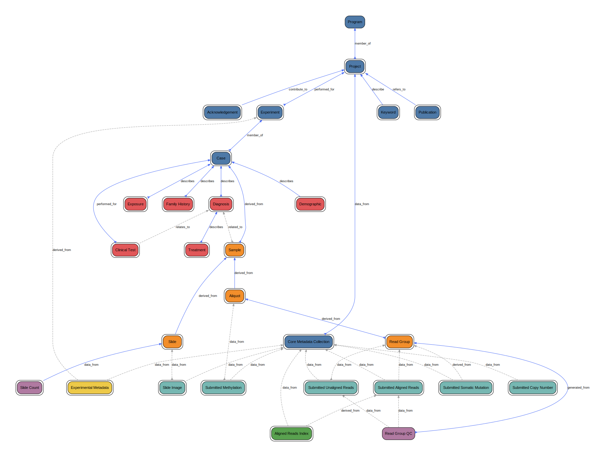

# Gen3 Data Dictionary Visualizer

A lightweight, standalone visualizer for bundled **Gen3** data dictionaries.

## What’s inside

- **`@gen3/dd-parser`** — TS library that normalizes a compiled Gen3 dictionary into a simple graph model.
- **`@gen3/dd-viz`** — builds a GraphViz DOT document and renders the graph into SVG in React.
- **`dd-viz-app`** — zero-backend Vite app: drag & drop your JSON or load via path.

> Node 18+ recommended.

## Quick start

If you don't have it already, [install npm](https://docs.npmjs.com/downloading-and-installing-node-js-and-npm).

```bash
# clone this repo
git clone https://github.com/AustralianBioCommons/gen3-dd-viz && cd gen3-dd-viz

# at repo root
npm install

# build all packages + app
npm run build

# run the app
npm run dev
```

Open the URL shown by Vite (default is http://localhost:5173).

## Workspace scripts

- `npm run build` — builds parser, viz, and the app
- `npm run typecheck` — type checks packages and app
- `npm run dev` — launches `apps/dd-viz-app` in dev mode

## Testing
Run unit tests:

```bash
npm run -w @gen3/dd-parser test
npm run -w @gen3/dd-viz test
```

## Example Dictionaries

This repository includes example Gen3 dictionary JSON files in [`examples/`](./examples/):

- [`dcf.json`](./examples/dcf.json)
- [`ega.json`](./examples/ega.json)
- [`gdc.json`](./examples/gdc.json)

These can be used to test the parser or to explore the visualization without needing to create your own schema.

